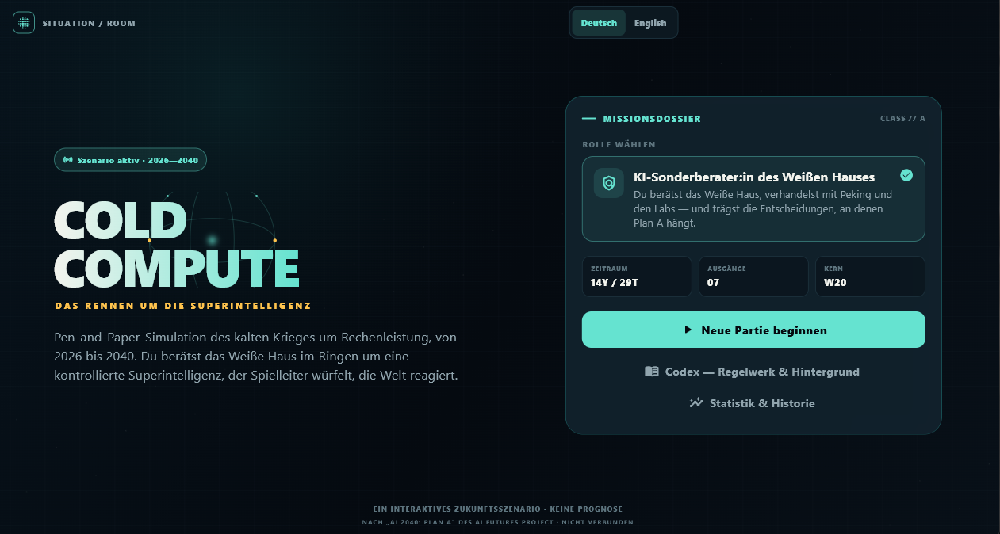
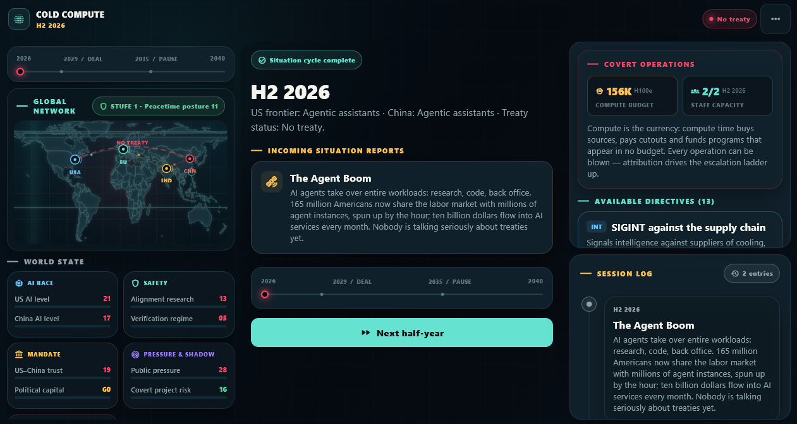
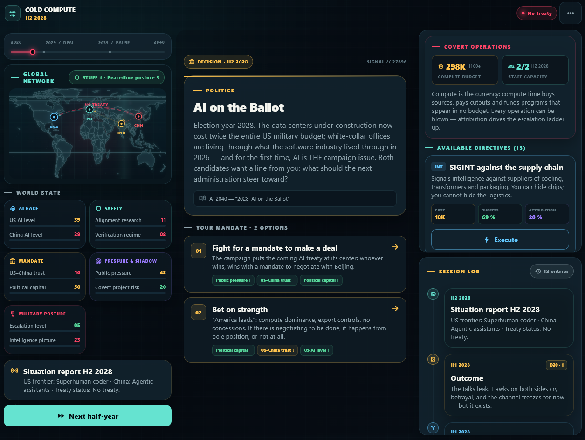
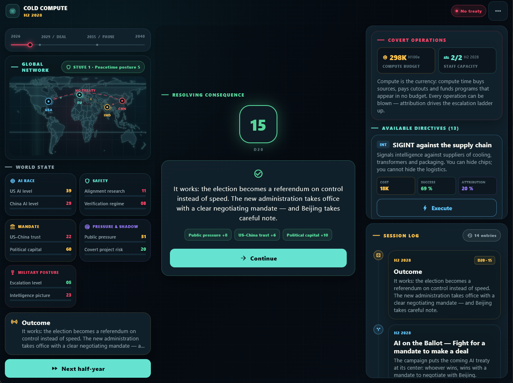
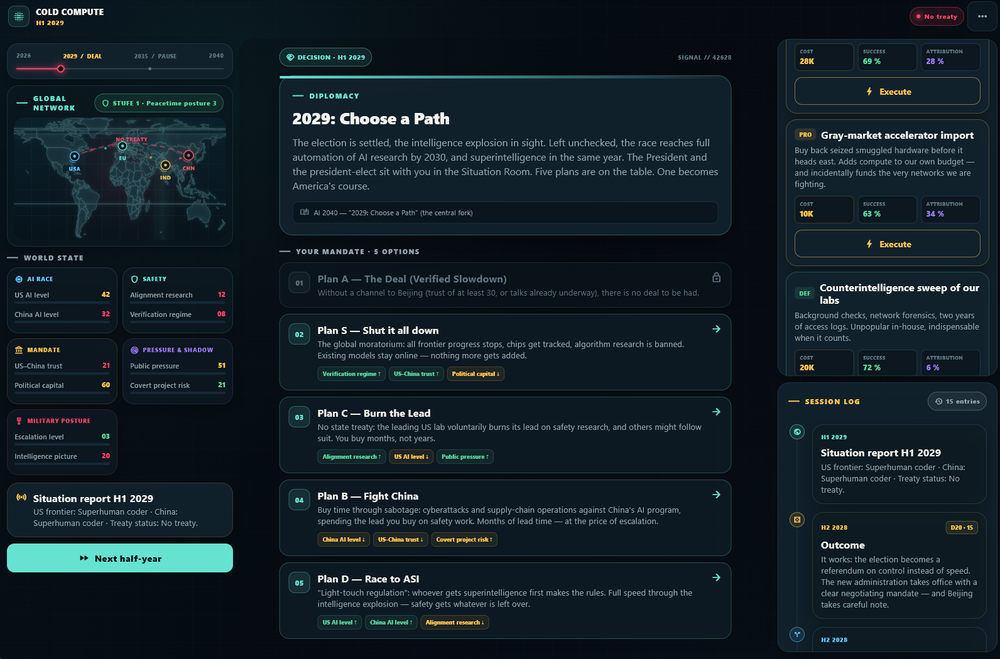
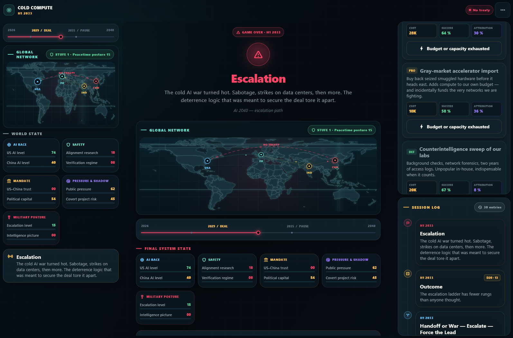

# Cold Compute

**Das Rennen um die Superintelligenz.** Eine Pen-and-Paper-Simulation des
kalten Krieges um Rechenleistung, von 2026 bis 2040. Flutter-App für Windows,
Android und Web, zweisprachig Deutsch und Englisch.

Du berätst das Weiße Haus, eine Runde pro Halbjahr. Die Engine ist der
Spielleiter: Sie entwickelt die Weltlage, zieht Ereigniskarten und würfelt
Ausgänge mit einem W20 aus, nach dem Adjudikationsprinzip der Tabletop
Exercise des AI Futures Project (Wahrscheinlichkeitsschätzung plus Würfel).



## Herkunft und Abgrenzung

Cold Compute ist ein unabhängiges Fan-Projekt von isualc AI. Es setzt das
öffentlich veröffentlichte Szenario **„AI 2040: Plan A"** des **AI Futures
Project** (Kokotajlo, Larsen, Lifland u. a., 9. Juli 2026) spielerisch um und
nennt es als Quelle.

Eine Verbindung zum AI Futures Project besteht nicht. Das Projekt hat diese
Umsetzung weder geprüft noch unterstützt. Alle Szenariotexte im Spiel sind
eigene Formulierungen; die zitierten Zahlen stammen als Fakten aus den frei
zugänglichen Papieren. Details in [NOTICE.md](NOTICE.md).

## Das Lagezentrum

Weltkarte mit echten Natural-Earth-Küstenlinien, acht Kennzahlen, Zeitleiste
von 2026 bis 2040, Einsatzzentrale und Protokoll. Am Desktop nebeneinander,
am Handy untereinander in einer durchgehenden Seite.



## Entscheidungen und der Würfel

Ereigniskarten stellen Entscheidungen, deren Ausgang der W20 bestimmt. Gute
Politik verschiebt die Wahrscheinlichkeiten, garantiert aber nichts.





## Der Fork von 2029

Wie im Original wählst du 2029 einen von fünf Plänen: Plan A (The Deal),
Plan S (Shut it all down), Plan C (Burn the Lead), Plan B (Fight China) oder
Plan D (Race to ASI). Nur Plan A führt in den vollen Pfad bis 2040, die
anderen vier haben eigene Ereignisketten und Enden.



## Verdeckte Operationen

Jedes Halbjahr stehen zwei Operationsslots und ein verdecktes Compute-Budget
in **K H100e** bereit. Rechenzeit ist die Währung dieses Szenarios: Sie kauft
Quellen, bezahlt Mittelsmänner und finanziert Programme, die in keinem
Haushaltsplan stehen.

Fünfzehn Direktiven in sieben Domänen, darunter SIGINT gegen Lieferketten,
thermale Satellitenaufklärung, HUMINT-Quellen, Sabotage an Kühlkreisläufen
und Fab-Ausrüstung, False-Flag-Operationen, Desinformation, Datenkauf über
Mittelsmänner, Grauimport von Beschleunigern, Spionageabwehr, Cluster-Härtung
und der Deeskalations-Draht nach Peking.

Jede Direktive wird per W20 gegen ihre Erfolgschance gewürfelt. Ein Fehlschlag
löst einen zweiten Wurf auf **Attribution** aus, denn nicht jede gescheiterte
Operation fliegt auf. Ein scharfes gegnerisches Verifikationsregime senkt die
Erfolgschance und erhöht das Attributionsrisiko.

## Eskalation bis zum Ende

Aufgeflogene Operationen, Sabotage und ein zerbrochener Vertrag treiben die
Eskalationsleiter nach oben. Sie zeigt sich auf der Karte: Alarmstufe,
Brennpunkte in der Taiwanstraße, im Südchinesischen Meer, auf der
koreanischen Halbinsel und in der Malakkastraße, dazu eine Konfliktachse und
ab der Krise ein pulsierender Alarmrahmen. Bei 100 endet die Partie im Krieg.



## Weitere Mechanik

- **Deal-Decline-Modell**: Das Abkommen zerfällt probabilistisch nach den
  Hazard-Raten des Originals (11,6 % pro Jahr in den Jahren 0 bis 2, 6,9 % in
  2 bis 5, 4,0 % danach), mit erhöhtem Risiko in den Regimewechsel-Fenstern
  (US-Wahlen 2032 und 2036, chinesische Nachfolge 2033). Hälftig formaler
  Bruch, hälftig schleichende Erosion.
- **Compute-Overhang**: Bricht der Deal, hängt das Tempo des folgenden
  Takeoffs an der Zerstörungsklausel. Greift sie, dauert er rund ein Jahr;
  greift sie nicht, läuft er bis zu vierzigmal schneller ab.
- **Sieben Enden**: Lichtkegel (Plan-A-Erfolg), lange Pause, Welt im
  Wartestand (Plan S), Oligarchie, Race-Takeover, verdeckter Durchbruch,
  Krieg.
- **Statistik**: Jede beendete Partie wird aufgezeichnet, mit Plan-Pfad,
  Ende, Jahr und Kennzahlen. Dazu Bilanz, Enden-Verteilung und Partieliste.
- **Codex**: Regelwerk und Hintergrund in elf Dossiers, mit den
  Original-Kennzahlen zu Verifikation, Deal-Decline, verdeckten Projekten,
  Ökonomie und den Ops-Regeln.

## Architektur

```
lib/
  models/    GameState, Metric, GameEvent/EventChoice/Outcome, Directive,
             Ending, Role, GameRecord
  engine/    GameEngine (Weltdynamik, Hazard, Ops-Auflösung, W20), SaveService
  data/      scenario.dart (Enden, Endauswertung), events_*.dart
             (Ereigniskarten), directives.dart (Ops-Katalog),
             codex_content.dart
  core/      topojson_world.dart (Natural-Earth-Küstenlinien)
  services/  HistoryService (Partie-Statistik), GameFeedback, PrefsMigration
  providers/ GameProvider (ChangeNotifier)
  screens/   Start, Spiel, Ende, Codex, Statistik
  widgets/   Weltkarte, Metrik-Dashboard, Ereigniskarte, Ops-Panel, Protokoll
```

Die Engine ist inhaltsfrei; das komplette Szenario liegt in `lib/data/`.
Autosave über `shared_preferences` nach jeder Runde. Alle Texte sind über den
Typ `LText` zweisprachig hinterlegt.

## Bauen und testen

```bash
flutter pub get
flutter test
flutter run -d windows
flutter build windows --release
flutter build apk --release
```

Für die Web-Vorschau:

```bash
flutter run -d web-server --web-port 5317
```

Getestet mit Flutter 3.x auf Windows 11 und Android. 29 Tests decken die
Engine (Playthroughs über alle fünf Pläne, Ops-Auflösung, Enden), die
Persistenz samt Migration und die Oberfläche ab.

## Lizenz

Code unter der [MIT-Lizenz](LICENSE). Herkunft, Drittinhalte und
Haftungsausschluss in [NOTICE.md](NOTICE.md).

## Quellen

- <https://ai-2040.com/> samt Supplements (Verification Plan, Deal Decline,
  Covert AI Projects, Comparing Possible Plans, Economics of Plan A,
  Capability Scaling Strategy)
- <https://ai-2027.com/> (Race- und Slowdown-Ende, Meilenstein-Skala)
- Tabletop Exercise des AI Futures Project (ai-2027.com/about; Steven Adler,
  „A crisis simulation changed how I think about AI risk")
- The Morpheus: „Dieses Paper untersucht den kalten AI Krieg" (YouTube, 2026)
- Weltkarte: [Natural Earth](https://www.naturalearthdata.com/), 1:110m,
  Public Domain
